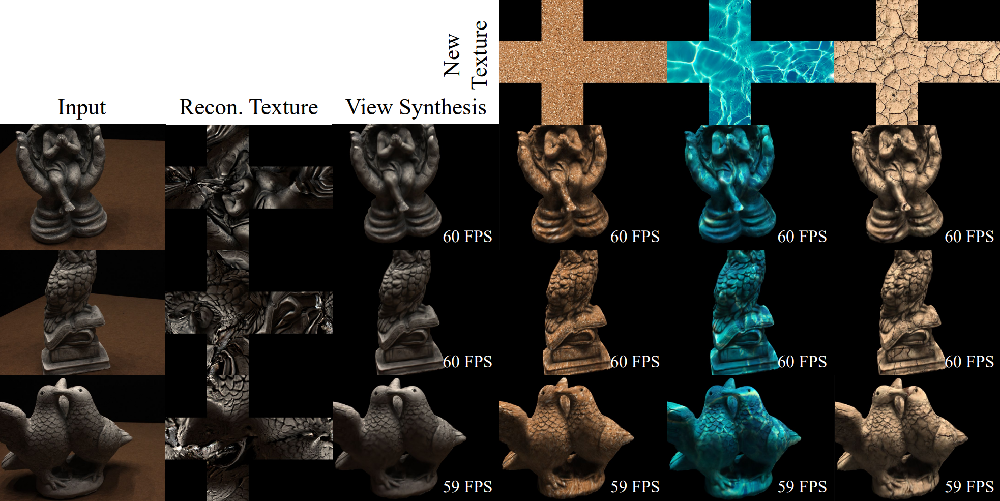

# Texture-GS: Disentangling the Geometry and Texture for 3D Gaussian Splatting Editing
The official repo for "[Texture-GS: Disentangling the Geometry and Texture for 3D Gaussian Splatting Editing](https://arxiv.org/pdf/2403.10050.pdf)"

<p align="center">
<a href="https://arxiv.org/pdf/2403.10050.pdf"></a>
<a href="https://slothfulxtx.github.io/TexGS/"></a>
</p>

## :mega: Updates

[18/3/2024] The project page is created.

[18/3/2024] The official repo is initialized.

## Abstract

3D Gaussian splatting, emerging as a groundbreaking approach, has drawn increasing attention for its capabilities of high-fidelity reconstruction and real-time rendering. However, it couples the appearance and geometry of the scene within the Gaussian attributes, which hinders the flexibility of editing operations, such as texture swapping. To address this issue, we propose a novel approach, namely Texture-GS, to disentangle the appearance from the geometry by representing it as a 2D texture mapped onto the 3D surface, thereby facilitating appearance editing. Technically, the disentanglement is achieved by our proposed texture mapping module, which consists of a UV mapping MLP to learn the UV coordinates for the 3D Gaussian centers, a local Taylor expansion of the MLP to efficiently approximate the UV coordinates for the ray-Gaussian intersections, and a learnable texture to capture the fine-grained appearance. Extensive experiments on the DTU dataset demonstrate that our method not only facilitates high-fidelity appearance editing but also achieves real-time rendering on consumer-level devices, e.g. a single RTX 2080 Ti GPU.

## Texture Swapping with Texture-GS

<p align="center">

</p>

## TODO

- [x] Release the demo page and more video results.
- [ ] Release the code. 

## Requirements

## Dataset Preparation

## Get Started

## View Texture-GS with OpenGL

## Train Texture-GS from Scratch

Our training stage is composed of three steps, including geometry reconstruction, UV mapping learning and texture reconstruction. First, run the training scripts `train.py` and specify the config file `configs/gaussian3d_base.yaml` to obtain the initial 3D Gaussian-based geometry, use `CUDA_VISIBLE_DEVICES` to specify the GPU number

```shell
python train.py configs/gaussian3d_base.yaml
```

The checkpoints, point clouds of 3D-GS, config files and tensorboard event file during training are saved to `output/gaussian3d_base/[timestamp1]/`. Then, extract a point cloud from the checkpoints to obtain a psedo ground truth point cloud that roughly covered the underlying surface for UV mapping learning. Run the scripts `extract_pcd.py` and specify path to the checkpoint.

```shell
python extract_pcd.py configs/gaussian3d_base.yaml \
    --resume_from output/gaussian3d_base/[timestamp]/checkpoints/30000.pth \
    --save_path output/gaussian3d_base/[timestamp1]/pcd.npy
```

The extracted point cloud `pcd.npy` as well as a ply file `pcd.ply` for visualization on VSCode (we recommend vscode-3d-preview extension) is generated in the save path. After obtaining the psedo GT, we can learn a UV mapping corresponding to the geometry with Chamfer Distance loss. Notably, you need to modify the following lines in the config file `configs/uv_map.yaml`

```yaml
    init_from: output/gaussian3d_base/[timestamp1]/checkpoints/30000.pth
    pcd_load_from: output/gaussian3d_base/[timestamp1]/pcd.npy
```

Then, run the following training script. Notable, the `PSNR` `L1` and `SSIM` metrics output by the scripts are meaningless here, because we only concern about the geometry of 3D Gaussians.

```shell
python train.py configs/uv_map.yaml
```

The checkpoints, config files and tensorboard event file during training are saved to `output/uv_map/[timestamp2]/`. We also visualize the inverse UV mapping process in `output/uv_map/[timestamp2]/pcds/` by randomly sampling points on UV space and then projecting them back to 3D space. Finally, we modify the following lines in `configs/texture_gaussian3d.yaml` to specify the initial path for 3D Gaussian and UV mapping, and then train our Texture-GS

```yaml
    init_from: output/gaussian3d_base/[timestamp1]/checkpoints/30000.pth
    init_uv_map_from: output/uv_map/[timestamp2]/checkpoints/15000.pth
```

```shell
python train.py configs/texture_gaussian3d.yaml
```

We take the training process of DTU scan 118 as example. If you want to train Texture-GS on other scenes, such as DTU scan 122, just modify `data_root_dir` in all config files. We train our model with `800*600` resolution images on the DTU dataset to compare with previous works. However, the original resolution `1600*1200` is also supported by setting the following line `resolution: -1`. 

## Citation

If you find this code useful for your research, please consider citing:
```
@misc{xu2024texturegs,
    title={Texture-GS: Disentangling the Geometry and Texture for 3D Gaussian Splatting Editing}, 
    author={Tian-Xing Xu and Wenbo Hu and Yu-Kun Lai and Ying Shan and Song-Hai Zhang},
    year={2024},
    eprint={2403.10050},
    archivePrefix={arXiv},
    primaryClass={cs.CV}
}
```

## Acknowledgements

This project is built on source codes shared by [3DGS](https://github.com/graphdeco-inria/gaussian-splatting) and [diff-gaussian-rasterization](https://github.com/graphdeco-inria/diff-gaussian-rasterization).

