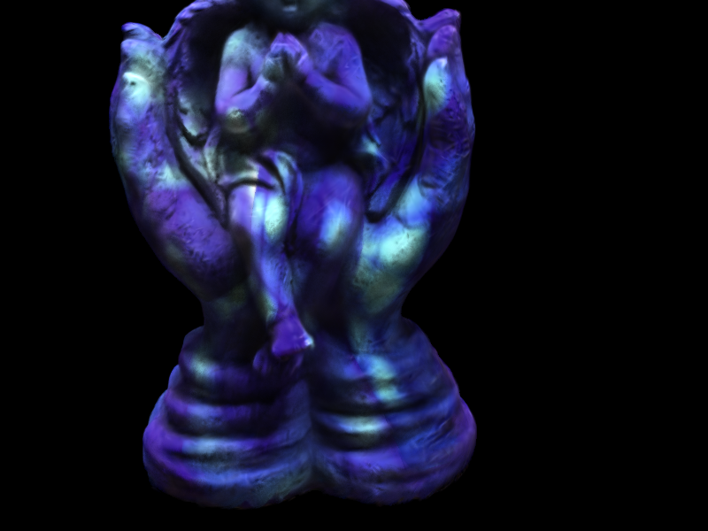
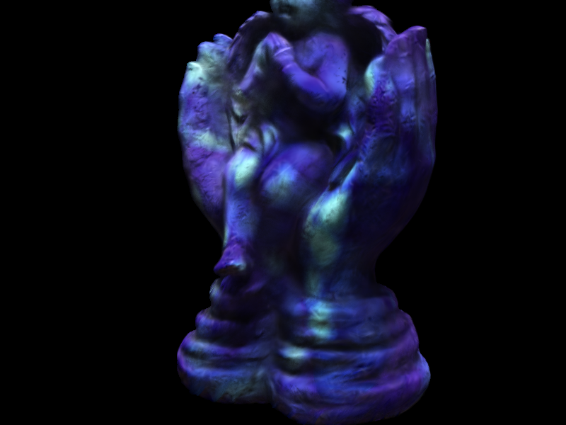
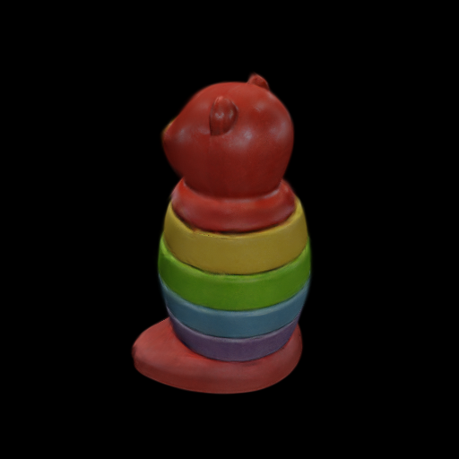
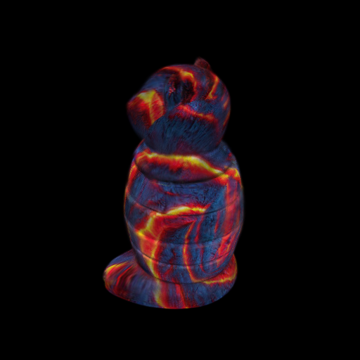
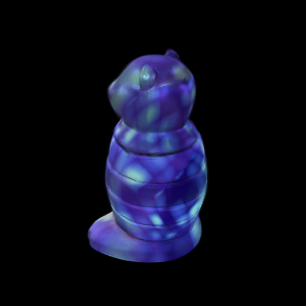

# Texture-GS: Disentangling the Geometry and Texture for 3D Gaussian Splatting Editing
The official repo for "[Texture-GS: Disentangling the Geometry and Texture for 3D Gaussian Splatting Editing](https://arxiv.org/pdf/2403.10050.pdf)"

<p align="center">
<a href="https://arxiv.org/pdf/2403.10050.pdf"></a>
<a href="https://slothfulxtx.github.io/TexGS/"></a>
<a href="https://www.youtube.com/watch?v=mn_vi4a_fu4"></a>
</p>

## :mega: Updates

[02/7/2024] Our paper is accepted by ECCV 2024. Welcome to discuss with us in MiCo Milano.

[28/5/2024] The code is released, including training code, viewer and pretrained models.

[18/3/2024] The project page is created.

[18/3/2024] The official repo is initialized.

## Abstract

3D Gaussian splatting, emerging as a groundbreaking approach, has drawn increasing attention for its capabilities of high-fidelity reconstruction and real-time rendering. However, it couples the appearance and geometry of the scene within the Gaussian attributes, which hinders the flexibility of editing operations, such as texture swapping. To address this issue, we propose a novel approach, namely Texture-GS, to disentangle the appearance from the geometry by representing it as a 2D texture mapped onto the 3D surface, thereby facilitating appearance editing. Technically, the disentanglement is achieved by our proposed texture mapping module, which consists of a UV mapping MLP to learn the UV coordinates for the 3D Gaussian centers, a local Taylor expansion of the MLP to efficiently approximate the UV coordinates for the ray-Gaussian intersections, and a learnable texture to capture the fine-grained appearance. Extensive experiments on the DTU dataset demonstrate that our method not only facilitates high-fidelity appearance editing but also achieves real-time rendering on consumer-level devices, e.g. a single RTX 2080 Ti GPU.

## Texture Swapping with Texture-GS

<p align="center">

</p>

## TODO

- [x] Release the demo page and more video results.
- [X] Release the code.
- [ ] Add more explanations. 

## Requirements

Our experiements are conducted on the platform with `CUDA=11.7`, `torch==1.13.1` and `pytorch3d==0.7.6`. However, other version should also be compatible. 

Other dependencies have been listed in the `requirements.txt`. 

## Dataset Preparation

**DTU dataset**: We follow [Relightable 3D Gaussian](https://github.com/NJU-3DV/Relightable3DGaussian) to prepare DTU data, which contains a foreground mask and a psedo-ground truth normal maps for each scenes. Download the zip file of preprocessed DTU data [here](https://box.nju.edu.cn/f/d9858b670ab9480fb526/?dl=1) and then create a soft link to `data/dtu/`. 

**Any obj file**: To create your synthetic dataset from obj files, such as Objaverse or Google Scanned Objects, we provide a preprocess script to render NeRF synthetic format dataset. We adopt `blender=3.6.11` to render images, with the params `elevs` and `num_renders` to speficy the elevation angles of camera poses and the number of images per elevation angles, respectively.

```shell
cd scripts
blender -noaudio --background --python render_obj_file.py -- \
    --object_path path/to/your/obj/file \
    --output_dir path/to/your/dataset \
    --num_renders 12 \
    --elevs -30 0 30 60
```

:warning: **Limitations** :warning:: We define the texture space as a unit sphere, which is ill-suited to represent multiple objects, objects with complex geometry(e.g. NeRF Synthetic chair, lego) or outdoor scenes.

## Get Started

We provide several pretrained models on DTU dataset and other object-level datasets [here](https://drive.google.com/drive/folders/1ZrvFAU2DuiWGw3Y68EFbiXJq8rUa-HuJ?usp=drive_link) to illustrate the appearance editing abilities of Texture-GS, especially global texture swapping. First, download the pretrained models and save them to the direction `pretrained/`. Then, run the following script to change the original texture with our provided creative texture images in `assets/`. Remember to modify `data_root_dir` in the configure file `texture_gaussian3d.yaml` with the corresponding model weights (remove `--load_texture_from` to visualize the original view synthesis results).

```shell
python retexture.py configs/texture_gaussian3d.yaml \
    --resume_from pretrained/dtu118.pth \
    --load_texture_from assets/textures/mosaic.png
```

The rendered images of DTU 118 with mosaic texture are stored to `output/texture_gaussian3d/tex_[timestamp0]`. Here're two examples of rendered images

<p align="center">


</p>

If you wanna visualize the learned texture images, run the following line to extract the texture image

```shell
python extract_texture.py configs/texture_gaussian3d.yaml \
    --resume_from pretrained/dtu118.pth \
    --save_path pretrained/dtu118_tex.png
```

Here's the corresponding texture image of pretrained DTU 114

<p align="center">

</p>

## View Texture-GS with OpenGL

We provide a real-time Open-GL based renderer for Texture-GS, which is built on source code shared by [Tiny Gaussian Splatting Viewer](https://github.com/limacv/GaussianSplattingViewer). Run the following lines (remove `--load_texture_from` to visualize the original view synthesis results)

```shell
python viewer.py configs/texture_gaussian3d.yaml \
    --resume_from pretrained/dtu118.pth \
    --load_texture_from assets/textures/mosaic.png
```

## Train Texture-GS on DTU from Scratch

Our training stage is composed of three steps, including geometry reconstruction, UV mapping learning and texture reconstruction. First, run the training scripts `train.py` and specify the config file `configs/gaussian3d_base.yaml` to obtain the initial 3D Gaussian-based geometry, use `CUDA_VISIBLE_DEVICES` to specify the GPU number

```shell
python train.py configs/gaussian3d_base.yaml
```

The checkpoints, point clouds of 3D-GS, config files and tensorboard event file during training are saved to `output/gaussian3d_base/[timestamp1]/`. Then, extract a point cloud from the checkpoints to obtain a psedo ground truth point cloud that roughly covered the underlying surface for UV mapping learning. Run the scripts `extract_pcd.py` and specify path to the checkpoint.

```shell
python extract_pcd.py configs/gaussian3d_base.yaml \
    --resume_from output/gaussian3d_base/[timestamp1]/checkpoints/30000.pth \
    --save_path output/gaussian3d_base/[timestamp1]/pcd.npy
```

The extracted point cloud `pcd.npy` as well as a ply file `pcd.ply` for visualization on VSCode (we recommend vscode-3d-preview extension) is generated in the save path. After obtaining the psedo GT, we can learn a UV mapping corresponding to the geometry with Chamfer Distance loss. Notably, you need to modify the following lines in the config file `configs/uv_map.yaml`

```yaml
    init_from: output/gaussian3d_base/[timestamp1]/checkpoints/30000.pth
    pcd_load_from: output/gaussian3d_base/[timestamp1]/pcd.npy
```

Then, run the following training script. Notable, the `PSNR` `L1` and `SSIM` metrics output by the scripts are meaningless here, because we only concern about the geometry of 3D Gaussians.

```shell
python train.py configs/uv_map.yaml
```

The checkpoints, config files and tensorboard event file during training are saved to `output/uv_map/[timestamp2]/`. We also visualize the inverse UV mapping process in `output/uv_map/[timestamp2]/pcds/` by randomly sampling points on UV space and then projecting them back to 3D space. Finally, we modify the following lines in `configs/texture_gaussian3d.yaml` to specify the initial path for 3D Gaussian and UV mapping, and then train our Texture-GS

```yaml
    init_from: output/gaussian3d_base/[timestamp1]/checkpoints/30000.pth
    init_uv_map_from: output/uv_map/[timestamp2]/checkpoints/15000.pth
```

```shell
python train.py configs/texture_gaussian3d.yaml
```

We take the training process of DTU scan 118 as example. If you want to train Texture-GS on other scenes, such as DTU scan 122, just modify `data_root_dir` in all config files. We train our model with `800*600` resolution images on the DTU dataset to compare with previous works. However, the original resolution `1600*1200` is also supported by setting the following line `resolution: -1`. 

## Train Texture-GS on Object derived dataset from Scratch

Due to the lack of psedo ground-truth normal maps, we train Texture-GS on object derived dataset with configure files `configs/gaussian3d_base_object.yaml` `configs/uv_map_object.yaml` and `configs/texture_gaussian3d_object.yaml`, which are slightly different from DTU configure files. Here's a simple example of STACKING_BEAR from GSO dataset.

<p align="center">



</p>


## Citation

If you find this code useful for your research, please consider citing:
```
@misc{xu2024texturegs,
    title={Texture-GS: Disentangling the Geometry and Texture for 3D Gaussian Splatting Editing}, 
    author={Tian-Xing Xu and Wenbo Hu and Yu-Kun Lai and Ying Shan and Song-Hai Zhang},
    year={2024},
    eprint={2403.10050},
    archivePrefix={arXiv},
    primaryClass={cs.CV}
}
```

## Acknowledgements

This project is built on source codes shared by [3DGS](https://github.com/graphdeco-inria/gaussian-splatting) and [diff-gaussian-rasterization](https://github.com/graphdeco-inria/diff-gaussian-rasterization).

